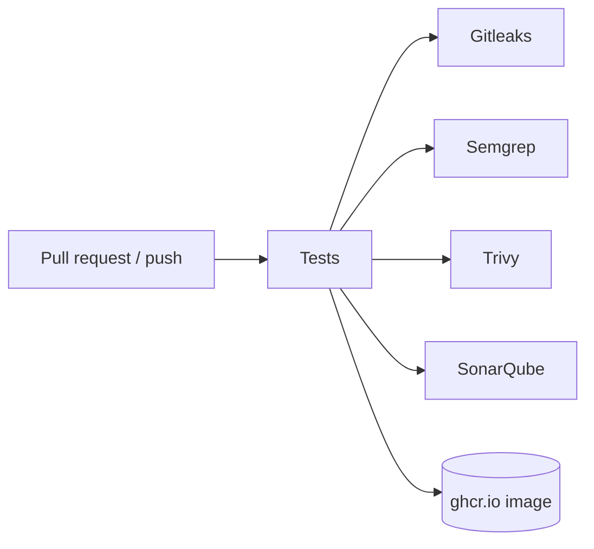

# python-backend

Application python-backend of project orchid.

## Pipeline

```mermaid
flowchart LR
  PR[Pull request / push] --> T[Tests]
  T --> GL[Gitleaks]
  T --> SG[Semgrep]
  T --> TV[Trivy]
  T --> SQ[SonarQube]
  T --> IMG[(ghcr.io image)]
```

## Run locally

See the README.
